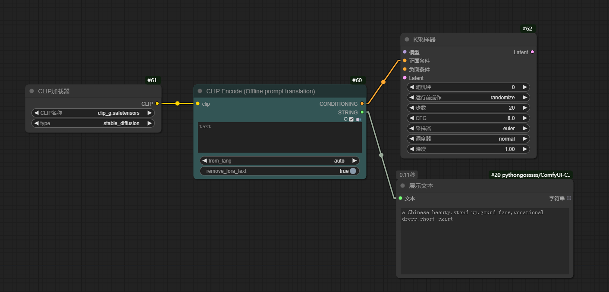
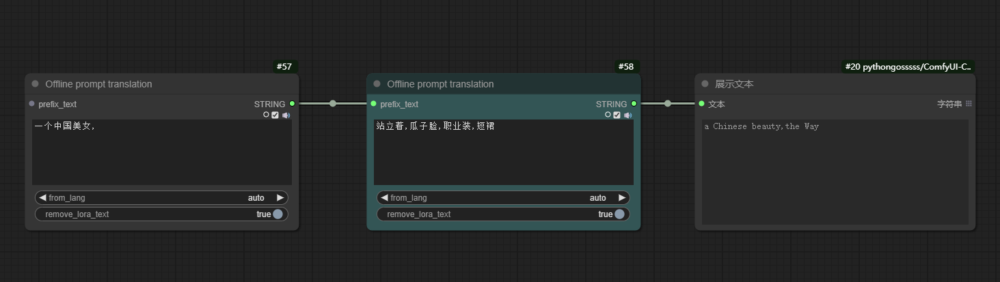

# PromptTranslator

A comfyui plugin with translation functionality based on the translation model [https://huggingface.co/Helsinki-NLP], no internet connection required.  
基于翻译模型 [https://huggingface.co/Helsinki-NLP] 实现的带翻译功能的comfyui插件，不需要联网。

Contained nodes:  
包含的节点：

1. PromptTranslator / offline_translate_clip_encode  
带离线翻译的clip编码节点

2. PromptTranslator / offline_prompt_translate  
带离线翻译的文本节点

# Workflow

# Install
Clone this repository into the custom_nodes directory of ComfyUI, and then restart ComfyUI  
克隆仓库代码到ComfyUI\custom_nodes目录，然后重启ComfyUI

Download translation model into the custom_nodes\ConfyUI-PromptTranslator\Helsinki-NLP directory of ComfyUI  
下载翻译模型放到ComfyUI\custom_nodes\ConfyUI-PromptTranslator\Helsinki-NLP目录

Only supports translation into English, so please download the opus-mt-{language to be translated}-en model  
只支持翻译成英文，所以请下载 opus-mt-{source languge}-en 模型

example: 
举例：
- [opus-mt-zh-en 中译英](https://huggingface.co/Helsinki-NLP/opus-mt-zh-en)
- [opus-mt-ru-en 俄译英](https://huggingface.co/Helsinki-NLP/opus-mt-ru-en)

You need to download these 7 files: 
需要下载这7个文件：
- config.json
- generation_config.json
- pytorch_model.bin
- source.spm
- target.spm
- tokenizer_config.json
- vocab.json
